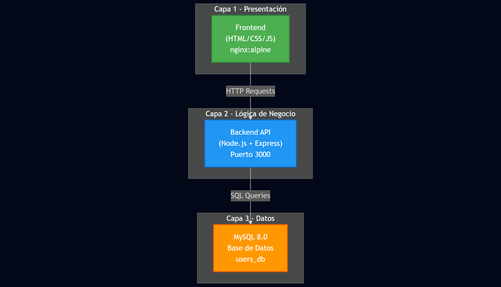
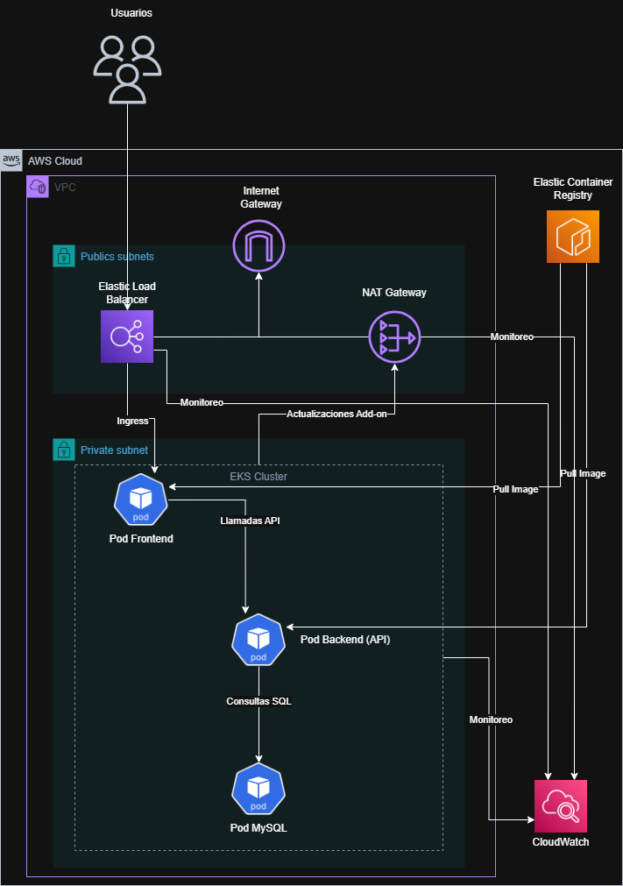
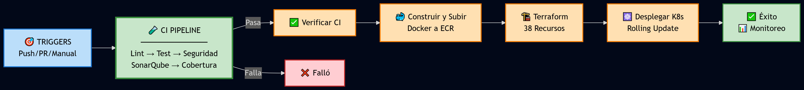
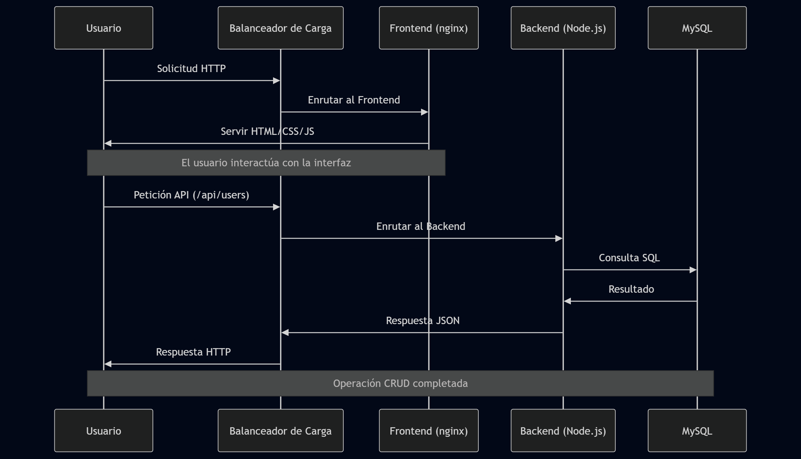
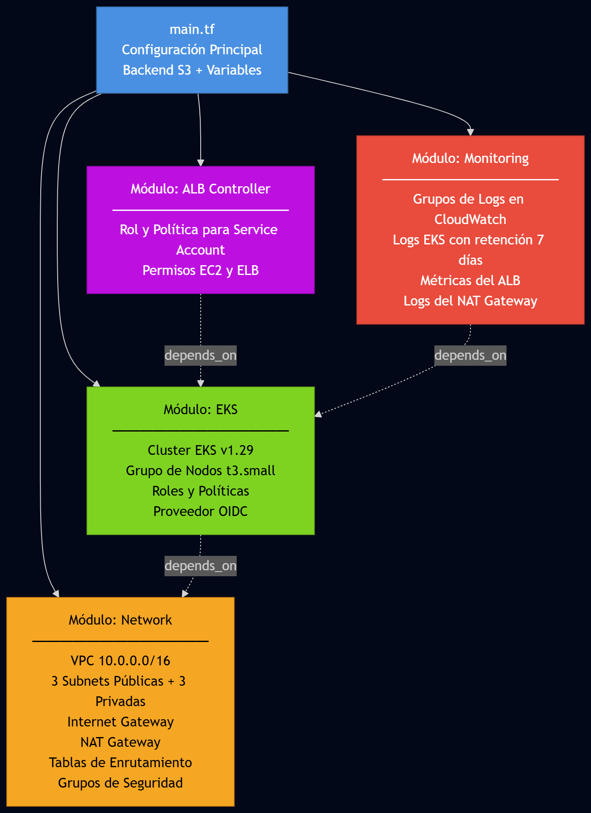

# App de Gestión de Usuarios

Aplicación de gestión de usuarios con **arquitectura de 3 capas**: Frontend (nginx), Backend (Node.js + Express) y Capa de datos (MySQL).

## 📋 Tabla de Contenidos

- [Contexto](#contexto)
- [Descripción](#descripción)
- [Arquitectura y Diagramas](#arquitectura-y-diagramas)
- [Requisitos](#requisitos)
- [Estructura del Proyecto](#estructura-del-proyecto)
- [Testing y Calidad de Código](#testing-y-calidad-de-código)
- [Despliegue Local (Docker Compose)](#despliegue-local-docker-compose)
- [Despliegue Automatizado con GitHub Actions](#despliegue-automatizado-con-github-actions)
- [Monitoreo y Observabilidad](#monitoreo-y-observabilidad)
- [API Reference](#api-reference)
- [Variables de Entorno](#variables-de-entorno)

---

## 🎯 Contexto

Se requiere la creación de una **aplicación web para la gestión de usuarios** que permita realizar operaciones CRUD (Crear, Leer, Actualizar, Eliminar) de manera eficiente y escalable. La aplicación debe implementar una **API REST funcional** para la gestión de usuarios con información básica como nombre y email, garantizando la integridad y persistencia de los datos.

La solución debe estar basada en una **arquitectura containerizada con Docker** para asegurar la portabilidad entre diferentes entornos, desde desarrollo local hasta producción. Se necesita implementar **infraestructura en la nube** utilizando Terraform como herramienta de Infrastructure as Code (IaC), permitiendo el aprovisionamiento automatizado y reproducible de todos los recursos necesarios en AWS.

---

## Descripción

### Funcionalidades Principales

La aplicación de gestión de usuarios implementa un conjunto completo de operaciones CRUD que permite:

- **Crear** un nuevo usuario con validación de datos (nombre y email)
- **Obtener** información detallada de usuario por ID único
- **Listar** todos los usuarios registrados en el sistema
- **Actualizar** información de usuario existente con validaciones
- **Eliminar** usuario del sistema de forma segura

### Solución Propuesta

La solución implementa una **arquitectura de microservicios moderna** utilizando contenedores Docker y orquestación con Kubernetes. El sistema está diseñado con una separación clara de responsabilidades mediante una arquitectura de 3 capas que garantiza escalabilidad, mantenibilidad y alta disponibilidad.

El **frontend** utiliza tecnologías web estándar (HTML5, CSS3, JavaScript) servidas a través de nginx como servidor web optimizado, proporcionando una interfaz de usuario intuitiva y responsiva. El **backend** está desarrollado en Node.js con Express.js, implementando una API REST robusta con manejo de errores, validaciones y logging estructurado. La **capa de datos** utiliza MySQL 8.0 como sistema de gestión de base de datos relacional, asegurando la consistencia e integridad de la información.

Para el despliegue, se han implementado **dos estrategias complementarias**: un entorno de desarrollo local usando Docker Compose que permite pruebas rápidas y desarrollo ágil, y un despliegue automatizado en AWS EKS mediante pipelines CI/CD con GitHub Actions. La infraestructura se gestiona completamente como código usando Terraform, incluyendo la creación de VPC, subnets, cluster EKS, repositorios ECR y configuración del Application Load Balancer para alta disponibilidad y distribución de carga.

## 🏢 Arquitectura y Diagramas

### 1. 📊 Arquitectura de la Aplicación (3 Capas)



### 2. 🌐 Arquitectura de Infraestructura AWS



### 3. 🚀 Pipeline CI/CD con GitHub Actions



### 4. 🔄 Flujo de Datos y Comunicación



### 5. 🛠️ Componentes de Terraform (Infraestructura como Código)



### Arquitectura 3 capas

| Capa | Componente | Tecnología |
|------|------------|------------|
| **1. Presentación** | Frontend | HTML, CSS, JS, nginx |
| **2. Lógica de negocio** | Backend | Node.js + Express |
| **3. Datos** | Base de datos | MySQL 8.0 |

### Tecnologías adicionales

| Componente | Tecnología |
|------------|------------|
| Contenedorización | Docker, Docker Compose |
| Infraestructura | Terraform modular (Network, EKS, ALB Controller, Monitoring) |
| Orquestación | Kubernetes (EKS) |
| Monitoreo | AWS CloudWatch |
| CI/CD | GitHub Actions |

---

## Requisitos

- **Node.js** >= 18 (para desarrollo local)
- **Docker** y **Docker Compose** (para despliegue local)
- **Terraform** >= 1.0 (para infraestructura AWS)
- **AWS CLI** (para despliegue en AWS)
- **Cuenta AWS** con credenciales configuradas

---

## Estructura del Proyecto

```
prueba_tecnica_devops/
├── backend/                 # Capa 2 - API REST
│   ├── src/
│   │   ├── config/         # Configuración de base de datos
│   │   ├── controllers/    # Lógica de negocio
│   │   ├── db/             # Conexión y queries
│   │   ├── models/         # Modelos de datos
│   │   ├── routes/         # Rutas de la API
│   │   └── index.js        # Punto de entrada
│   ├── __tests__/          # Tests unitarios e integración
│   │   ├── unit/           # Tests unitarios
│   │   └── integration/    # Tests de integración
│   ├── package.json
│   ├── Dockerfile
│   ├── Dockerfile.test     # Dockerfile para tests
│   └── .eslintrc.js
├── frontend/               # Capa 1 - Presentación
│   ├── index.html
│   ├── styles.css
│   ├── app.js
│   ├── nginx.conf          # Configuración nginx + proxy
│   └── Dockerfile
├── terraform/              # Infraestructura como Código
│   ├── main.tf             # Configuración principal
│   ├── variables.tf        # Variables de entrada
│   ├── outputs.tf          # Outputs de recursos
│   ├── providers.tf        # Proveedores AWS
│   ├── backend.tf          # Backend S3 para state
│   ├── modules/
│   │   ├── network/        # VPC, Subnets, NAT Gateway
│   │   ├── eks/            # Cluster EKS y Node Groups
│   │   ├── alb-controller/ # IAM para ALB Controller
│   │   └── monitoring/     # CloudWatch Logs y Métricas
│   └── terraform.tfvars.example
├── k8s/                    # Manifiestos Kubernetes
│   ├── namespace.yaml
│   ├── backend-deployment.yaml
│   ├── backend-service.yaml
│   ├── backend-secret.yaml
│   ├── frontend-deployment.yaml
│   ├── frontend-service.yaml
│   ├── mysql-deployment.yaml
│   ├── mysql-service.yaml
│   ├── mysql-secret.yaml
│   ├── mysql-configmap.yaml
│   ├── ingress.yaml        # ALB Ingress
│   ├── alb-controller-serviceaccount.yaml
│   └── kustomization.yaml
├── diagramas/              # Diagramas de arquitectura
│   ├── diagrama_3_capas.png
│   ├── arquitectura_aws.png
│   ├── diagrama_pipeline.png
│   ├── diagrama_secuencia.png
│   └── diagrama_terraform.png
├── .github/workflows/      # Pipelines CI/CD
│   ├── ci.yml              # Tests y calidad
│   ├── deploy.yml          # Despliegue infraestructura y apps
│   └── destroy-infrastructure.yml  # Destruir infraestructura
├── sonar-project.properties # Configuración SonarQube
├── docker-compose.yml      # Despliegue local
├── TESTING.md              # Documentación de tests
├── DEPLOYMENT.md           # Documentación de despliegue
└── README.md
```

---

## 🧪 Testing y Calidad de Código

El proyecto implementa una estrategia completa de testing y análisis de calidad:

### Tests Implementados

- ✅ **Tests Unitarios** - Modelos y controladores con Jest
- ✅ **Tests de Integración** - API completa con Supertest
- ✅ **Cobertura de Código** - Reportes con LCOV
- ✅ **Linting** - ESLint para estándares de código
- ✅ **Security Audit** - npm audit para vulnerabilidades
- ✅ **SonarQube Cloud** - Análisis continuo de calidad

### Ejecutar Tests Localmente

```bash
# Todos los tests con cobertura
cd backend && npm test

# Solo tests unitarios
npm run test:unit

# Solo tests de integración
npm run test:integration

# Linting
npm run lint

# Ejecutar todos los checks (simula CI)
./scripts/run-quality-checks.sh
```

### Pipeline CI/CD

**CI Pipeline** (`.github/workflows/ci.yml`):
1. Lint → Tests → Security Audit → SonarQube
2. Se ejecuta en cada push y PR

**CD Pipeline** (`.github/workflows/deploy.yml`):
1. Solo se ejecuta si CI pasa
2. Build → Deploy a AWS EKS

Ver [TESTING.md](TESTING.md) para documentación completa.

### Configurar SonarQube Cloud

1. Crear cuenta en https://sonarcloud.io
2. Editar `sonar-project.properties` con tu organización
3. Agregar `SONAR_TOKEN` en GitHub Secrets

---

## Despliegue Local (Docker Compose)

### Inicio rápido

```bash
# 1. Construir y levantar las 3 capas
docker-compose up -d

# 2. Acceder a la aplicación (Frontend en puerto 80)
# Navegador: http://localhost

# 3. API (a través de nginx en /api)
curl http://localhost/api/health
```

### Pasos detallados

1. **Clonar el repositorio**
   ```bash
   git clone <url-repositorio>
   cd prueba_tecnica_devops
   ```

2. **Levantar servicios**
   ```bash
   docker-compose up -d
   ```

3. **Verificar**
   - **Frontend (Capa 1):** http://localhost
   - **API (a través de nginx):** http://localhost/api/users
   - **Health:** http://localhost/api/health
   - **MySQL (Capa 3):** localhost:3307 (usuario: root, BD: users_db)

---

## Despliegue Automatizado con GitHub Actions

### 🚀 Despliegue Automático Completo

El proyecto utiliza GitHub Actions para automatizar completamente el proceso de despliegue:

1. ✅ **Build y Push de Imágenes Docker** a AWS ECR
2. ✅ **Despliegue de Infraestructura** con Terraform
3. ✅ **Despliegue de Manifiestos K8s** en EKS

**Triggers automáticos:**
- Push a ramas `main` o `develop`
- Pull requests hacia `main`
- Ejecución manual desde GitHub Actions

### Configuración Inicial

1. **Configurar Secrets en GitHub:**
   ```
   AWS_ACCESS_KEY_ID: Tu AWS Access Key ID
   AWS_SECRET_ACCESS_KEY: Tu AWS Secret Access Key
   ```

2. **Hacer push al repositorio:**
   ```bash
   git push origin main
   ```

3. **Monitorear el despliegue:**
   - Ve a Actions en tu repositorio de GitHub
   - Observa el progreso del pipeline "Deploy Infrastructure and Applications"

### 🛠️ Despliegue Manual con Terraform (Alternativo)

Si prefieres desplegar la infraestructura manualmente en AWS:

```bash
# 1. Configurar credenciales AWS
export AWS_ACCESS_KEY_ID="tu-access-key"
export AWS_SECRET_ACCESS_KEY="tu-secret-key"
export AWS_DEFAULT_REGION="us-east-1"

# 2. Navegar al directorio de Terraform
cd terraform

# 3. Inicializar y aplicar
terraform init
terraform plan
terraform apply
```

**Nota:** El despliegue manual requiere configurar posteriormente las imágenes Docker y manifiestos de Kubernetes manualmente.

### 📊 Comandos Útiles para Monitoreo

```bash
# Conectar a tu cluster EKS
aws eks update-kubeconfig --region us-east-1 --name <cluster-name>

# Ver estado de la aplicación
kubectl get pods -n ns-prueba-tecnica
kubectl get services -n ns-prueba-tecnica
kubectl get ingress -n ns-prueba-tecnica

# Ver logs
kubectl logs -f deployment/backend -n ns-prueba-tecnica
kubectl logs -f deployment/frontend -n ns-prueba-tecnica
```

Ver [DEPLOYMENT.md](DEPLOYMENT.md) para detalles completos del pipeline.

---

## 📊 Monitoreo y Observabilidad

La aplicación implementa una estrategia completa de monitoreo utilizando **AWS CloudWatch** para garantizar la visibilidad, trazabilidad y detección proactiva de problemas en la infraestructura y aplicaciones.

### Componentes Monitoreados

El sistema de monitoreo está configurado mediante Terraform (módulo `monitoring`) y cubre los siguientes componentes críticos:

#### 1. **Cluster EKS**
- **Control Plane Logs**: Logs de API server, audit, authenticator, controller manager y scheduler
- **Métricas de nodos**: CPU, memoria, disco y red de los worker nodes
- **Métricas de pods**: Estado, reintentos, y consumo de recursos
- **Retención**: 7 días para desarrollo, configurable para producción

#### 2. **Application Load Balancer (ALB)**
- **Request metrics**: Conteo de requests, latencia, códigos HTTP
- **Target health**: Estado de salud de los targets backend
- **Connection metrics**: Conexiones activas, nuevas y rechazadas
- **Error rates**: 4xx y 5xx errors para detección de problemas

#### 3. **NAT Gateway**
- **Network throughput**: Bytes enviados y recibidos
- **Connection tracking**: Conexiones activas y establecidas
- **Packet metrics**: Paquetes procesados y descartados
- **Error monitoring**: Detección de fallos en conectividad de salida

### Grupos de Logs CloudWatch

Los logs se organizan en grupos específicos para facilitar el análisis:

```
/aws/eks/prueba_devops-eks/cluster          # Logs del control plane de EKS
/aws/elasticloadbalancing/app/prueba_devops # Logs del ALB
/aws/vpc/natgateway/prueba_devops           # Logs del NAT Gateway
```

### Acceso a Logs y Métricas

**Desde AWS Console:**
```bash
1. Navegar a CloudWatch → Log groups
2. Seleccionar el grupo de logs deseado
3. Usar CloudWatch Insights para queries avanzadas
```

**Desde AWS CLI:**
```bash
# Ver logs del cluster EKS
aws logs tail /aws/eks/prueba_devops-eks/cluster --follow

# Ver logs del ALB
aws logs tail /aws/elasticloadbalancing/app/prueba_devops --follow

# Query con CloudWatch Insights
aws logs start-query \
  --log-group-name /aws/eks/prueba_devops-eks/cluster \
  --start-time $(date -u -d '1 hour ago' +%s) \
  --end-time $(date -u +%s) \
  --query-string 'fields @timestamp, @message | filter @message like /error/ | sort @timestamp desc'
```

**Desde kubectl (logs de aplicación):**
```bash
# Logs de pods específicos
kubectl logs -f deployment/backend -n ns-prueba-tecnica
kubectl logs -f deployment/frontend -n ns-prueba-tecnica

# Logs de todos los pods de un deployment
kubectl logs -f -l app=backend -n ns-prueba-tecnica --all-containers=true
```

### Métricas Clave a Monitorear

| Componente | Métrica | Threshold Recomendado |
|------------|---------|----------------------|
| EKS Nodes | CPU Utilization | > 80% |
| EKS Nodes | Memory Utilization | > 85% |
| ALB | Target Response Time | > 1s |
| ALB | HTTP 5xx Errors | > 1% |
| NAT Gateway | Packets Drop Count | > 0 |
| Pods | Restart Count | > 3 en 5min |

---

## API Reference

| Método | Ruta        | Descripción        |
|--------|-------------|--------------------|
| GET    | /           | Info del servicio  |
| GET    | /health     | Health check       |
| POST   | /users      | Crear usuario      |
| GET    | /users      | Listar todos los usuarios |
| GET    | /users/:id  | Obtener usuario    |
| PUT    | /users/:id  | Actualizar usuario |
| DELETE | /users/:id  | Eliminar usuario   |

### Crear usuario

**Request:**
```json
POST /users
Content-Type: application/json

{
  "name": "Juan Pérez",
  "email": "juan@ejemplo.com"
}
```

**Response (201):**
```json
{
  "id": 1,
  "name": "Juan Pérez",
  "email": "juan@ejemplo.com",
  "created_at": "2024-02-14T12:00:00.000Z",
  "updated_at": "2024-02-14T12:00:00.000Z"
}
```

---

## Variables de Entorno

| Variable     | Descripción              | Default   |
|-------------|--------------------------|-----------|
| PORT        | Puerto del servidor      | 3000      |
| DB_HOST     | Host MySQL               | localhost |
| DB_PORT     | Puerto MySQL             | 3306      |
| DB_NAME     | Nombre de la BD          | users_db  |
| DB_USER     | Usuario MySQL            | root      |
| DB_PASSWORD | Contraseña MySQL         | root123   |
